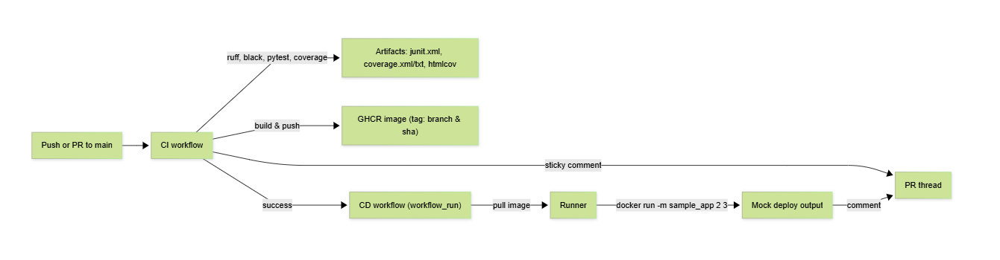

# CI/CD Design – Linqia Take-Home

**Owner:** <your-name>  
**Repo:** `<owner>/<repo>`  
**Registry:** GitHub Container Registry (GHCR) `ghcr.io/<owner>/<repo>`

---

## 1) Objectives & Scope

### Primary objectives
- **CI** (on push/PR to `main`)
  - Lint & style check (`ruff`, `black --check`)
  - Run unit tests on **Python 3.10/3.11/3.12**
  - Enforce **coverage ≥ 90%**
  - Build Docker image and **push to public registry**
  - Upload **artifacts** (JUnit, coverage XML/TXT, HTML report)
  - Post **PR comment** summarizing image tag, test results, coverage, artifact links
  - (Bonus) Scan image with **Trivy** (report-only)

- **CD** (after CI success)
  - Trigger via **`workflow_run`** only when CI **succeeds**
  - Pull the previously built image from GHCR
  - **Mock deploy** by running the container in the runner
  - Comment status/output on the PR

### Non-goals
- Provisioning cloud infra (ECS/Kubernetes)
- External coverage/SAST SaaS (keep self-contained)

---

## 2) High-Level Architecture



---

## 3) Repository Layout

```
.github/workflows/
  ci.yml            # Continuous Integration
  cd.yml            # Continuous Deployment (workflow_run)
sample_app/
  __init__.py
  __main__.py
  functions.py
tests/
  test_main.py
Dockerfile
.dockerignore
requirements-dev.txt
.coveragerc
design.md
```

---

## 4) CI Pipeline Design

**Workflow name:** `CI`  
**Triggers:** `push`, `pull_request` → branch `main`

### Jobs

#### 4.1 Matrix test/lint job
- **Runs on:** `ubuntu-latest`
- **Matrix:** `python-version: [3.10, 3.11, 3.12]`
- **Caching:** `actions/setup-python@v5` with `cache: pip` and `cache-dependency-path: requirements-dev.txt`
- **Steps & quality gates**
  1. Checkout
  2. Setup Python + cache
  3. Install dev deps (`pytest`, `pytest-cov`, `coverage`, `ruff`, `black`)
  4. **Lint**: `ruff check .` (must pass)
  5. **Style**: `black --check .` (must pass)
  6. **Tests + coverage**:
     - `pytest --cov=sample_app --cov-report=xml --cov-report=term-missing --cov-fail-under=90`
     - Also produce `junit.xml`, `coverage.txt`, and `htmlcov/`
  7. **Artifacts** (per Python version):
     - `junit.xml`, `coverage.xml`, `coverage.txt`, `htmlcov/`

#### 4.2 Single build/push job
- **Needs:** matrix job
- **When:** only if the matrix **succeeds**
- **Build:** `docker/build-push-action@v6` with GHA cache (`cache-from/to: gha`)
- **Login:** `docker/login-action@v3` → GHCR using `GITHUB_TOKEN`
- **Tagging strategy:**
  - **Human tag:** sanitized branch (or PR head branch) — only `[a-z0-9._-]`
  - **Immutable tag:** `${{ github.sha }}`
- **Security scan (bonus):** `aquasecurity/trivy-action@0.24.0` (report only; does not fail build)
- **Artifacts:** `image.txt` containing the pushed tags

### Coverage scoping
`.coveragerc` ensures the denominator is **only** app code:

```ini
[run]
source = sample_app
branch = True

[report]
show_missing = True
skip_covered = True
```

---

## 5) CD Pipeline Design

**Workflow name:** `CD`  
**Trigger:**  

```yaml
on:
  workflow_run:
    workflows: ["CI"]
    types: [completed]
```

- **Gate:** `if: github.event.workflow_run.conclusion == 'success'`
- **Tag resolution:** recompute **the same sanitized tag** from `workflow_run.head_branch`
- **Steps**
  1. Parse PR number (if PR) and head branch from event payload
  2. Login to GHCR
  3. Pull image: `ghcr.io/<owner>/<repo>:<sanitized-branch>`
  4. Mock deploy: `docker run <image> -m sample_app 2 3` → expect output `5`
  5. Post PR comment with image + output (requires `issues: write` permission)

---

## 6) Naming, Tagging & Sanitization

Docker tags **cannot** contain `/` or spaces (PR refs like `2/merge` are invalid).  
We compute a “safe” tag for **both** CI and CD:

- For PRs: `github.event.pull_request.head.ref`
- For pushes: `github.ref_name`
- Transform: lowercase + `sed 's/[^a-z0-9._-]/-/g'`
- Fallback: use `github.sha` if empty

---

## 7) Secrets & Permissions

- **No external secrets** needed for GHCR (use `GITHUB_TOKEN`)
- CI permissions:
  ```yaml
  permissions:
    contents: read
    packages: write
    pull-requests: write
  ```
- CD permissions:
  ```yaml
  permissions:
    contents: read
    packages: read
    issues: write
    pull-requests: write
  ```

---

## 8) Verification Plan

- Check **CI run** for:
  - Lint/style ✅
  - Test coverage ≥ 90% ✅
  - Artifacts uploaded ✅
  - Image built & pushed to GHCR ✅
- Check **CD run** for:
  - Triggered via `workflow_run` ✅
  - Pulled image successfully ✅
  - Mock deploy printed `5` ✅
  - PR comment posted ✅

---